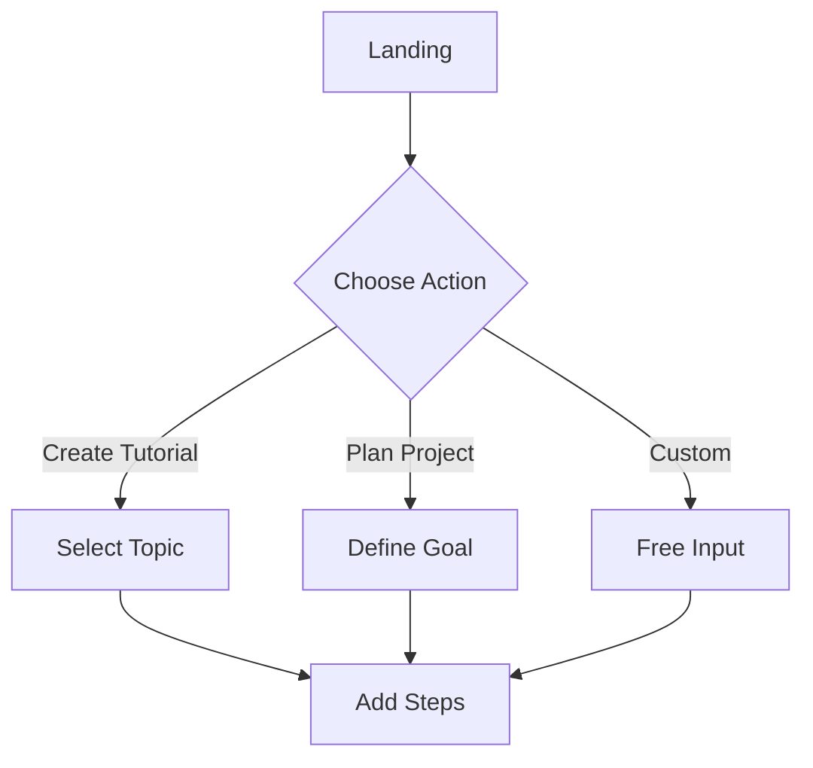
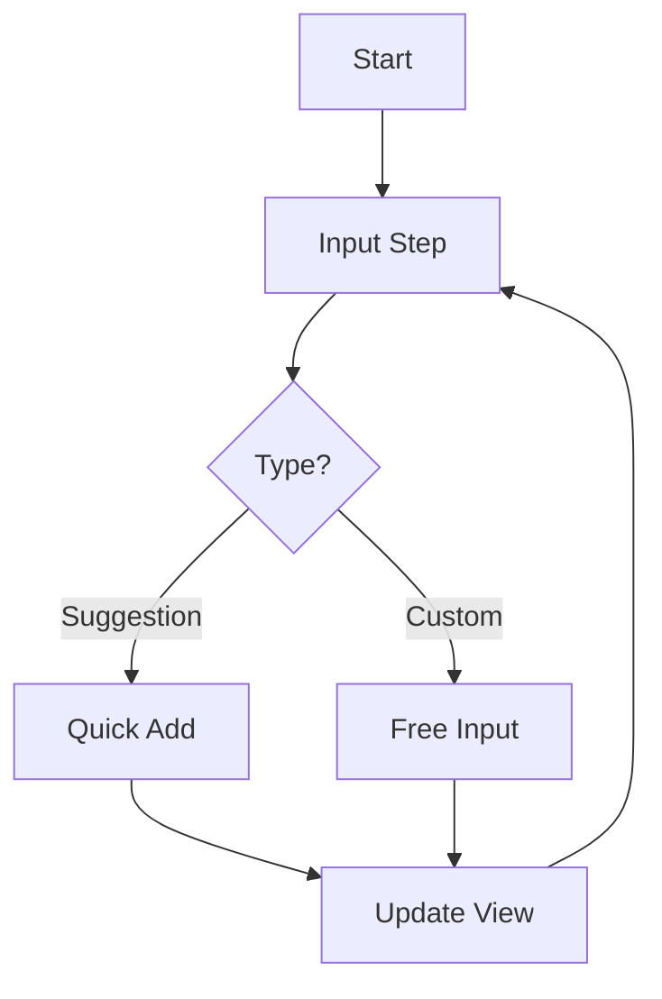

# Design Guide
Date: December 12, 2023

## Design Philosophy
Workflow Canvas embraces minimalism and intuitive interaction to create a seamless workflow management experience. The design focuses on progressive disclosure and contextual interactions to reduce cognitive load.

## Design System

### Colors
```css
/* Primary Colors */
--primary-blue: #3B82F6;  /* Brand color, calls-to-action */
--primary-white: #FFFFFF; /* Background, cards */
--primary-gray: #F3F4F6; /* Secondary background */

/* Text Colors */
--text-primary: #1F2937; /* Main text */
--text-secondary: #6B7280; /* Secondary text */
--text-white: #FFFFFF; /* Text on dark backgrounds */

/* Accent Colors */
--accent-success: #10B981; /* Success states */
--accent-warning: #F59E0B; /* Warning states */
--accent-error: #EF4444; /* Error states */
```

### Typography
```css
/* Font Families */
--font-primary: 'Inter', sans-serif;
--font-mono: 'JetBrains Mono', monospace;

/* Font Sizes */
--text-xs: 0.75rem;
--text-sm: 0.875rem;
--text-base: 1rem;
--text-lg: 1.125rem;
--text-xl: 1.25rem;
--text-2xl: 1.5rem;
```

### Spacing
```css
/* Spacing Scale */
--space-1: 0.25rem;
--space-2: 0.5rem;
--space-3: 0.75rem;
--space-4: 1rem;
--space-6: 1.5rem;
--space-8: 2rem;
```

## Component Library

### Chat Interface
```jsx
// Message Bubble
<div className="max-w-3/4 rounded-lg p-4 bg-white text-gray-800">
  <p className="text-base">Message content</p>
  {suggestions && (
    <div className="mt-3 space-y-2">
      {/* Suggestion buttons */}
    </div>
  )}
</div>

// Input Area
<div className="p-4 bg-white border-t">
  <div className="flex space-x-4">
    <input className="flex-1 px-4 py-2 border rounded-lg" />
    <button className="px-6 py-2 bg-blue-500 text-white rounded-lg">
      Send
    </button>
  </div>
</div>
```

### Workflow Visualization
```jsx
// Step Card
<div className="p-4 rounded-lg bg-gray-50 hover:bg-gray-100">
  <div className="flex items-start space-x-3">
    <div className="w-6 h-6 rounded-full bg-blue-500 text-white flex items-center justify-center">
      {stepNumber}
    </div>
    <div className="flex-1">
      <p className="text-gray-800">{stepContent}</p>
    </div>
  </div>
</div>
```

## User Experience Flow

### 1. Initial Interaction


### 2. Workflow Creation


## Interaction Patterns

### 1. Progressive Disclosure
- Show basic options first
- Reveal advanced features as needed
- Keep interface clean and focused

### 2. Contextual Assistance
- Provide relevant suggestions
- Show help when needed
- Clear error messages

### 3. Visual Feedback
- Immediate response to actions
- Clear state changes
- Loading indicators

## Animation Guidelines

### Transitions
```css
/* Standard Transition */
transition: all 200ms ease-in-out;

/* Smooth Hover */
transform: translateY(-2px);
transition: transform 150ms ease;

/* Loading Animation */
@keyframes spin {
  to { transform: rotate(360deg); }
}
```

## Responsive Design

### Breakpoints
```css
/* Mobile First */
@media (min-width: 640px) { /* sm */ }
@media (min-width: 768px) { /* md */ }
@media (min-width: 1024px) { /* lg */ }
@media (min-width: 1280px) { /* xl */ }
```

### Layout Adjustments
1. Mobile
   - Single column layout
   - Bottom navigation
   - Collapsible sections

2. Tablet
   - Split view available
   - Side navigation
   - Expanded sections

3. Desktop
   - Full split view
   - Advanced features
   - Multiple panels

## Accessibility Guidelines

### 1. Color Contrast
- Minimum 4.5:1 for normal text
- Minimum 3:1 for large text
- Test all color combinations

### 2. Keyboard Navigation
- Focus indicators
- Logical tab order
- Keyboard shortcuts

### 3. Screen Readers
- Proper ARIA labels
- Semantic HTML
- Alternative text

## Design Principles

### 1. Clarity
- Clear visual hierarchy
- Consistent patterns
- Obvious actions

### 2. Efficiency
- Minimal clicks
- Quick access
- Smart defaults

### 3. Feedback
- Clear status indicators
- Error prevention
- Success confirmation

## Implementation Tips

### 1. Component Structure
```jsx
// Atomic Design Pattern
atoms/
  Button.js
  Input.js
  Icon.js
molecules/
  MessageBubble.js
  StepCard.js
organisms/
  ChatInterface.js
  WorkflowVisualization.js
```

### 2. Style Organization
```css
/* Base Styles */
@layer base {
  /* Typography, Reset */
}

/* Components */
@layer components {
  /* Reusable Patterns */
}

/* Utilities */
@layer utilities {
  /* Custom Helpers */
}
```

## Testing Guidelines

### 1. Visual Testing
- Component screenshots
- Responsive views
- Dark/light modes

### 2. Interaction Testing
- User flows
- Edge cases
- Error states

### 3. Accessibility Testing
- Screen reader compatibility
- Keyboard navigation
- Color contrast

## Documentation

### 1. Component Documentation
- Usage examples
- Props interface
- Styling options

### 2. Design Tokens
- Color system
- Typography scale
- Spacing units

### 3. Pattern Library
- Common patterns
- Best practices
- Anti-patterns
